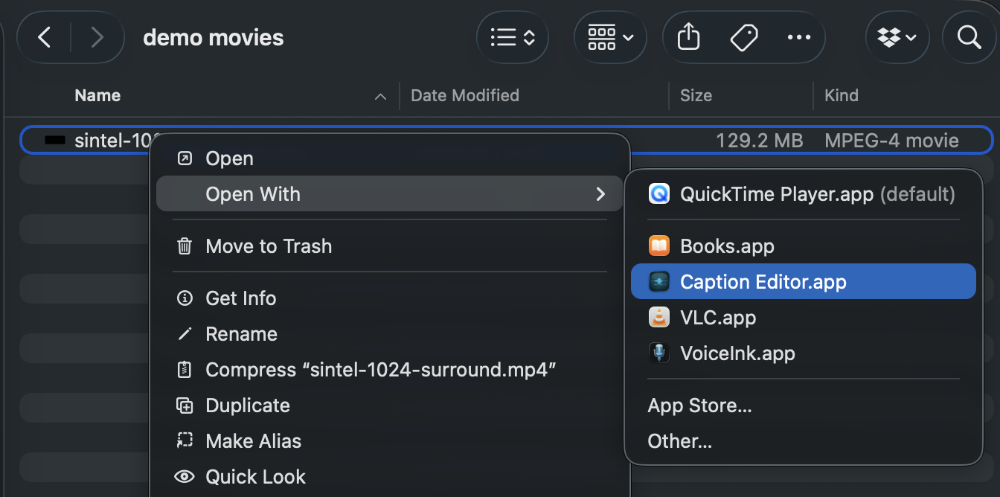
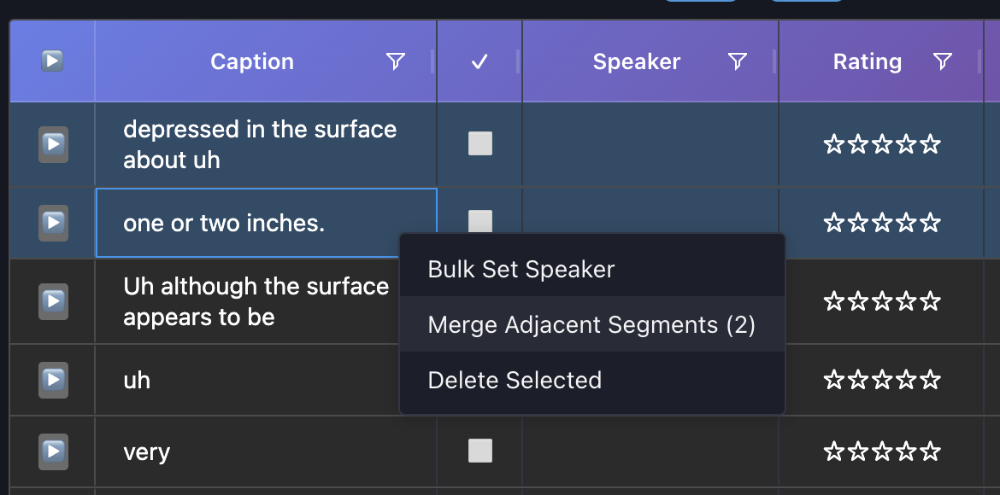
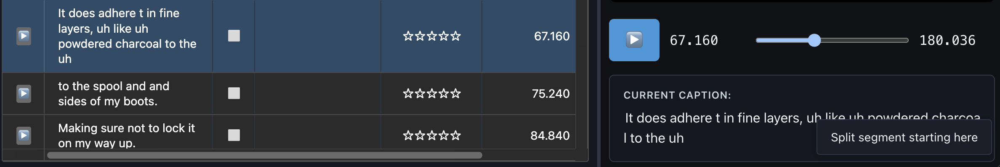
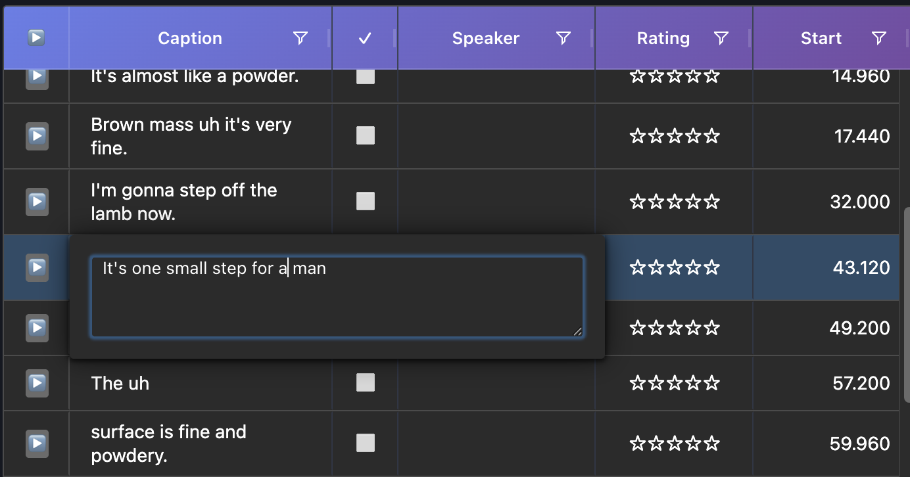
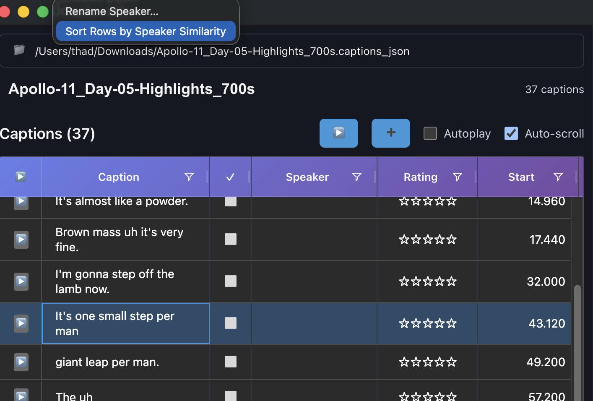

# Caption Editor

Caption Editor lets you run a modern, multi-lingual speech recognizer and speaker ID model on your own local media files, and easily interact with and edit the results.

🖥️ **Local First** — Run fast, SOTA multilingual Automatic Speech Recognition (ASR) and Speaker Identification models entirely on-device
  * NVIDIA Parakeet ASR model supports 27 European languages:                                                       

🎬 **Smooth Workflows** — Visualize, edit, and annotate model results as time-aligned captions with synced playback and scrubbing

🔗 **Interoperable** — Store captions and metadata in easy-to-parse JSON5 sidecar files

⚡ **Modern** — Open-source Electron UI with native macOS integrations

It's a media annotation and labeling tool for your own data, to help make it more useful and findable for you.

I built Caption Editor as a side project, partly as a test case while we built [Sculptor](https://imbue.com/sculptor/) at Imbue.  I firmly believe that any user interface for AI models should also let you annotate and correct the model's output, and that you should own that data as well.  This gives you the power the evaluate and tune AI models on your own data.

This project is driven by the philosophy that 90+% of data labeling should be done "in flow", using the same tools you'd be using for other useful work, which in this case means media playback, indexing and curating.

In short: I wanted to combine AI-assisted labeling with the ability to easily correct the labels when I saw something wrong.


## User Quickstart

0. [Download](https://github.com/thadd3us/caption_editor/releases/download/v1.5.31/Caption.Editor-1.5.31-arm64.dmg) the app and copy it into Applications.

1. Find or download a media file.  Some examples:

  * [Apollo 11 Intro](https://images-assets.nasa.gov/video/Apollo_11_Intro_720p/Apollo_11_Intro_720p~small.mp4) ([from NASA](https://images.nasa.gov/details/Apollo_11_Intro_720p))
  * [Apollo 11 Moonwalk Montage](https://images-assets.nasa.gov/video/Apollo_11_moonwalk_montage_720p/Apollo_11_moonwalk_montage_720p~small.mp4) ([from NASA](https://images.nasa.gov/details/Apollo_11_moonwalk_montage_720p))
  * [Apollo 13: Home Safe](https://dn721601.ca.archive.org/0/items/nasa_tv-Apollo_13_-_Home_Safe/Apollo_13_-_Home_Safe.mp4)
  * [Sintel](http://peach.themazzone.com/durian/movies/sintel-1024-surround.mp4) [from Blender](https://durian.blender.org/download/)

2. Open the file with Caption Editor.



3. Menu item: "AI Annotations > Caption with Speech Recognizer" (this also computes speaker ID embeddings on each ASR segment)
   * This is quite complex and may or may not work on your system.
   * The first run will be slow and download a lot (~GBs).
   * It downloads [uvx](https://docs.astral.sh/uv/) for your platform, then uses `uvx run` to:
      * Download part of this repo.
      * Download a large Python environment, including PyTorch and NumPy.
      * Run a Python program from this repo, which uses HuggingFace to download models and run them.
   * The models are:
      * [parakeet-tdt-0.6b-v3](https://huggingface.co/nvidia/parakeet-tdt-0.6b-v3)
      * [wespeaker-voxceleb-resnet34-LM](https://huggingface.co/pyannote/wespeaker-voxceleb-resnet34-LM)

4. Select multiple adjacent segments to merge (if necessary).


4. Split segments that should be separate (if necessary).
You do this by right-clicking the words in the selected caption on the bottom right:


5. Edit captions by double-clicking in table.


6. Pick a segment, then sort segments by similarity to that speaker.


7. Set speaker names by editing the Speaker column. With several rows selected, changing one speaker cell applies the same name to all selected rows.

The play button above the table plays segments in the table order, jumping around the audio file, so you can listen to all segments with similar speaker embeddedings.

## Other tips

* `.captions_json5` files contain a relative path pointing to their media file.
* This app associates with the `.captions_json5` extension, so double-clicking this file opens the captions and the media file.
* Each caption segment has a UUID.

## Bulk Processing

To run ASR and speaker embedding on an entire directory tree from the project root:

```bash
uv run --directory transcribe/ python bulk_cli.py /path/to/media/
```

Options:
- `--recognizer mock` — dry run with a fast deterministic stub (no model download)
- `--always-update-speaker-embeddings` — re-embed files that already have embeddings (doesn't change speaker label names)

Files with an existing `.captions_json5` sidecar are skipped, so you can Ctrl-C and resume at any time.


### Development nNtes

#### Development Mode
```bash
# Install dependencies
npm install

# Build the Electron app (must be done first)
npm run build:all && npm run dev:electron

# Or run the built app directly
# FIXME: Document what this actually does.
npm start
```

#### Production / Packaged Mode
```bash
# Build everything
npm run build:all

# Package for your platform (creates distributable app)
npm run package:mac     # macOS (.app bundle)
npm run package:win     # Windows (.exe installer)
npm run package:linux   # Linux (AppImage)

# The packaged app will be in the dist/ directory
# Note: Python environment bundling is not yet implemented
```

**Note on Python ASR Integration:**
- In **development mode**, the app uses `uv run python` to execute transcription scripts from `transcribe/`
- In **production mode** (packaged app), Python environment bundling is planned but not yet implemented
- The app will validate that required Python scripts exist before attempting to run ASR

### Core Functionality

- **Captions JSON Support**: Open and edit `*.captions_json5` documents (primary save/load format)
- **SRT Import/Export**: Import `*.srt` files and export to standard SRT
- **Media Playback**: Load and play video or audio files alongside captions
- **Drag & Drop**: Intuitive file loading - drop captions JSON/SRT and media files together or separately
- **Dual Panel Layout**: Resizable split view with caption table (left, 60% default) and media player (right)

### Caption Management

- **Rich Editing**: Edit timestamps, caption text, and metadata directly in the table
- **Star Ratings**: Rate captions 1-5 stars with click-to-rate interface
- **UUID Tracking**: Automatic UUID generation and persistence for each caption
- **Temporal Sorting**: Captions automatically sort by start time, then end time
- **Validation**: Timestamp and duration validation prevents invalid edits

### Media Controls

- **Standard Playback**: Play, pause, and scrub through media
- **Snippet Playback**: Play individual caption segments with auto-stop
- **Seek to Caption**: Jump to any caption's start time

### Data Persistence

- **Stable JSON**: All metadata (UUIDs, ratings, history) is preserved in `*.captions_json5`

### Technical Details

- **Framework**: Vue 3 with TypeScript and Composition API
- **State Management**: Pinia for reactive document state
- **UI Components**: AG Grid for high-performance caption table
- **Immutable Data**: Caption entries are immutable for efficient state management
- **Testing**: Playwright end-to-end tests for all operations

## Getting Started

### Prerequisites

- Node.js 18+ and npm/pnpm/yarn
- For testing: Playwright browsers (installed via `npx playwright install`)

### Development Container

This project includes a complete devcontainer setup with all dependencies pre-installed:

```bash
# Using VS Code
1. Install the "Dev Containers" extension
2. Open the project in VS Code
3. Click "Reopen in Container" when prompted
   (or use Command Palette: "Dev Containers: Reopen in Container")

# Using GitHub Codespaces
1. Click "Code" → "Codespaces" → "Create codespace on main"
2. Everything is pre-configured!
```

The devcontainer includes:
- Node.js 20
- All npm dependencies pre-installed
- Playwright browsers and system dependencies
- VS Code extensions for Vue, TypeScript, and Playwright
- Port forwarding for dev server (3000) and test reports (9323)


### Testing

This project has comprehensive test coverage including unit tests, end-to-end tests, and build verification.

#### Quick Test Commands

```bash
# Run ALL tests (unit + e2e + build verification) - recommended for CI/pre-commit
npm run test:all

# Run unit tests only (Vitest)
npm run test:unit

# Run E2E tests only (Playwright)
npm run test:e2e

# Run TypeScript build verification only
npm run test:build

# Interactive test UIs
npm run test:unit:ui      # Vitest UI
npm run test:e2e:ui       # Playwright UI

# Coverage reports
npm run test:coverage     # Generate combined coverage report
npx playwright show-report # View Playwright HTML report

# First-time setup
npx playwright install    # Install Playwright browsers
```

#### Platform-Specific Testing (Linux/Docker)

On Linux containers without a display server (like the devcontainer), you need Xvfb for Electron tests:

```bash
# Start Xvfb (only needed once per container session)
start-xvfb.sh

# Run Electron tests with DISPLAY set
# Note: DISPLAY=:99 is set by default in the devcontainer
npm run test:e2e

# Or manually with DISPLAY:
DISPLAY=:99 npx playwright test tests/electron/
```

**Troubleshooting Xvfb:**
- If tests fail with "Missing X server", run `start-xvfb.sh`
- Check if running: `ps aux | grep "[X]vfb"`
- For more debugging tips, see `CLAUDE.md` → "Why Xvfb Keeps Dying"

**macOS/Windows:**
- Xvfb is not needed - tests work natively
- Just run `npm run test:e2e` directly

**Recommended workflow:**
- During development: `npm run test:unit` (fast feedback)
- Before committing: `npm run test:all` (complete verification)
- For debugging: Use the UI modes (`test:unit:ui` or `test:e2e:ui`)

## Debugging

### Inspecting Document State

In development mode, the Pinia store is exposed on `window.$store` for easy debugging. Open the browser console and use:

```javascript
// View the complete document structure as formatted JSON
console.log(JSON.stringify($store.document, null, 2))

// Access individual properties
console.log($store.document.segments.length)      // Number of segments
console.log($store.document.segments)             // Segments (always sorted by time)
console.log($store.currentSegment)                // Current segment at playhead
console.log($store.currentTime)                   // Current playback position
console.log($store.mediaPath)                     // Loaded media file path

// View a specific segment
console.log(JSON.stringify($store.document.segments[0], null, 2))
```

**Example output:**

```json
{
  "segments": [
    {
      "id": "550e8400-e29b-41d4-a716-446655440000",
      "startTime": 1.5,
      "endTime": 4.25,
      "text": "First caption",
      "rating": 5
    }
  ],
  "filePath": "example.captions_json5"
}
```

This outputs the complete TypeScript `CaptionsDocument` structure including all segments with their IDs, timestamps, text, and ratings.

**Note:** The store is only exposed in development mode (`npm run dev`). In production builds, use Vue DevTools extension for state inspection.

## References

- [WebVTT Specification](https://www.w3.org/TR/webvtt1/)
- [WebVTT Data Model](https://www.w3.org/TR/webvtt1/#data-model)
- [UT Austin WebVTT Guide](https://sites.utexas.edu/cofawebteam/requirements/ada/captions/webvtt-files-for-video-subtitling/)
